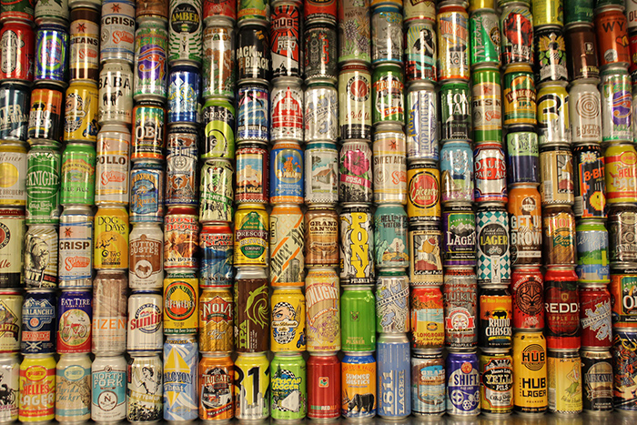

# Craft Beer & Data Science

## Description

In this series of notebooks, you'll explore :mag_right: the fantastic world of craft beers :beers: through the lenses of data. 

You'll learn how to:

-  :memo: Build a dataset from a website
-  :ledger: Clean up and structure a dataset 
-  :chart_with_upwards_trend: Profile a data set using descriptive statistics (_in-progress_)
-  :bar_chart: Visualize your data (_in-progress_)
-  :fire: Enhance your data set with external data sources (_in-progress_)

    
:point_right: **[Start here!](https://github.com/nickhould/craft-beers-dataset/blob/master/notebooks/Craft%20Beer%20%26%20Data%20Science%20-%20Part%201%20-%20Scraping%20a%20Dataset.ipynb)**:point_left:

## Media
- [Scraping for Craft Beers: A Dataset Creation Tutorial - Kaggle](http://blog.kaggle.com/2017/01/31/scraping-for-craft-beers-a-dataset-creation-tutorial/)

## Contact 
Feel free to reach out:

- [Twitter](https://twitter.com/nicholashould)
- [Email](jn@jeannicholashould.com)
- [Website](http://www.jeannicholashould.com)

[Jean-Nicholas Hould](http://www.jeannicholashould.com)